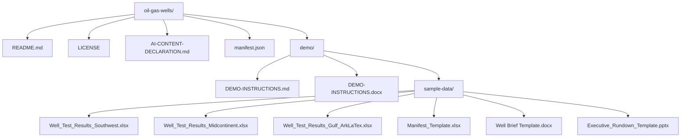

# MTT Demo Creation Tools

Public skill repository for MTT demo-on-demand tooling used by Scout and Cowork.

## Installing locally

Download the raw skill file and any required support files from the canonical URLs below, then place
them in the local skill folder used by Scout or Cowork. For generate-data, install `SKILL.md`,
`companies.csv`, and `names.csv` together so name and company validation can run locally.

For Cowork, install `cowork/demo-builder-SKILL.md` with its `cowork/references/` companion files.
The creator-only maintenance support skill is only for maintainers updating the skill repository;
ordinary end users do not need it for demo package creation.

Creators maintaining Scout or Cowork should load the shared edit guardrails support skill before
editing either demo builder so both skills keep equivalent safety, quality, publishing, and
verification behavior.

Before running either demo builder skill, validate that its local `SKILL.md` exists and that the
generate-data folder contains all three required files. If a file is missing, download it from the
full public GitHub URL rather than relying on a relative path.

## Prompt: install everything for Scout

Use this prompt in Scout to install or refresh the Scout demo builder and the shared generate-data
dependency:

```text
Install these two skills from https://github.com/rob-foulkrod/mtt-demo-creation-tools

- scout/demo-on-demand-SKILL.md → install as skill "demo-on-demand"
- Common/generate-data/ → install as "generate-data", including companies.csv and names.csv
```

## Prompt: install everything for Cowork

Use this prompt in Cowork to install or refresh the Cowork demo builder and the shared generate-data
dependency:

```text
Install these Cowork demo-builder files from https://github.com/rob-foulkrod/mtt-demo-creation-tools

- cowork/demo-builder-SKILL.md → install as skill "demo-on-demand"
- cowork/references/ → install as companion references for the Cowork demo builder
- Common/generate-data/ → install as "generate-data", including companies.csv and names.csv
```

## Example Prompt

Use this prompt to create a GitHub-ready demo package with the Scout demo-on-demand skill and the
shared generate-data compliance skill:

```text
/demo-on-demand Using this skill and the generate-data skill I want to create a set of demos for an upcoming copilot class. I will give you a list of scenarios and will need the documents and demo instructions. Clearly label each demo. I am going to start with Agent Chaining. Agent Chaining is when I use Chat in Microsoft Copilot and attach the agents I need. For this demo I will simulate getting Three Excel files that I need to analyze and create a weekly Manifest File. The data is a series of test well results for the oils and gas industry. Use five states where a lot of test wells are dug around Texas where my customer is based. Include mineral data and other indicators common for this industry. My prompt should combine the results of all three files and show graphics. First I will have added the Analyst agent. Then I run the first prompt. When I get the results which should include graphics, I will then add the excel agent and reference a Manifest template file which you will also create and name Manifest_Template. And this prompt will ask copilot to create the new file from the data in the chat. The incoming files should have data we do not need for this manifest such as weather and land rights etc. and only have the analysis results so all up numbers by area and state with latitude and longitude and include a map visual. Once that is done, We will change to the word agent and using a word template called "Well Brief Template" that you will also create, we will create a new Well Brief based on the information from our chat so far. The Well brief should be highly stylized. Once we have that brief we will add the PPT agent and create a rundown based on a similarly styled PPTX that you will create a template for as well and we will add to the chat for context when we create the PPTX. Lastly we will prompt copilot for a brief email and agenda so we can send out the meeting invites. Use consistent style in all the templates for a modern corporate look that is not plain
```

Example output structure:




## Repository layout

| Path | Purpose |
| --- | --- |
| [`scout/demo-on-demand-SKILL.md`](https://github.com/rob-foulkrod/mtt-demo-creation-tools/blob/main/scout/demo-on-demand-SKILL.md) | Scout demo builder skill. It asks whether the package will be uploaded to GitHub, then creates either a GitHub-ready public demo repository package or a Cowork-compatible folder package. |
| [`scout/demo-on-demand-creator-maintenance-SKILL.md`](https://github.com/rob-foulkrod/mtt-demo-creation-tools/blob/main/scout/demo-on-demand-creator-maintenance-SKILL.md) | Creator-only support skill for maintaining the Scout demo builder, versions, change logs, repository updates, and local installed copies. |
| [`cowork/demo-builder-SKILL.md`](https://github.com/rob-foulkrod/mtt-demo-creation-tools/blob/main/cowork/demo-builder-SKILL.md) | Cowork demo builder runtime skill. It creates private-delivery, folder-native demo packages for OneDrive or SharePoint destinations and progressively loads companion references. |
| [`cowork/references/`](https://github.com/rob-foulkrod/mtt-demo-creation-tools/tree/main/cowork/references) | Cowork companion references for quality standards, presenter-guide specifications, and technology-specific guidance. |
| [`cowork/demo-builder-creator-maintenance-SKILL.md`](https://github.com/rob-foulkrod/mtt-demo-creation-tools/blob/main/cowork/demo-builder-creator-maintenance-SKILL.md) | Creator-only support skill for maintaining the Cowork demo builder, companion references, versions, change logs, and repository updates. |
| [`Common/demo-builder-edit-guardrails-SKILL.md`](https://github.com/rob-foulkrod/mtt-demo-creation-tools/blob/main/Common/demo-builder-edit-guardrails-SKILL.md) | Shared creator-only edit guardrails for keeping Scout and Cowork demo-builder behavior aligned during maintenance. |
| [`Common/generate-data/SKILL.md`](https://github.com/rob-foulkrod/mtt-demo-creation-tools/blob/main/Common/generate-data/SKILL.md) | Shared generate-data compliance skill used before creating fictional companies, people, email addresses, or sample data. |
| [`Common/generate-data/companies.csv`](https://github.com/rob-foulkrod/mtt-demo-creation-tools/blob/main/Common/generate-data/companies.csv) | Approved fictitious company and domain list used by the generate-data skill. |
| [`Common/generate-data/names.csv`](https://github.com/rob-foulkrod/mtt-demo-creation-tools/blob/main/Common/generate-data/names.csv) | Approved person-name list used by the generate-data skill. |
| [`change logs/`](https://github.com/rob-foulkrod/mtt-demo-creation-tools/tree/main/change%20logs) | Versioned skill change logs documenting additions and deletions for every skill update. |

## How versioning works

Each skill carries its own version in frontmatter `metadata.version` and in its version section:

| Skill | Current version | Canonical source |
| --- | --- | --- |
| Scout demo builder | `2026.09.04.8` | `https://raw.githubusercontent.com/rob-foulkrod/mtt-demo-creation-tools/main/scout/demo-on-demand-SKILL.md` |
| Scout creator maintenance | `1.0.1` | `https://raw.githubusercontent.com/rob-foulkrod/mtt-demo-creation-tools/main/scout/demo-on-demand-creator-maintenance-SKILL.md` |
| Cowork demo builder | `2.3.2` | `https://raw.githubusercontent.com/rob-foulkrod/mtt-demo-creation-tools/main/cowork/demo-builder-SKILL.md` |
| Cowork creator maintenance | `1.1.1` | `https://raw.githubusercontent.com/rob-foulkrod/mtt-demo-creation-tools/main/cowork/demo-builder-creator-maintenance-SKILL.md` |
| Shared edit guardrails | `1.0.1` | `https://raw.githubusercontent.com/rob-foulkrod/mtt-demo-creation-tools/main/Common/demo-builder-edit-guardrails-SKILL.md` |
| Generate data | `2026.09.04.5` | `https://raw.githubusercontent.com/rob-foulkrod/mtt-demo-creation-tools/main/Common/generate-data/SKILL.md` |

At the start of a run, the installed skill should check its canonical raw GitHub URL. If the public
copy has a higher version, it should tell the user and offer to download and install the updated
local copy before continuing. If the check cannot be completed, the skill can continue with the
installed version while disclosing that the update check was skipped.

## Generate-data dependency

Both demo builder skills depend on the shared generate-data skill whenever a package needs
fictional companies, people, email addresses, or sample data. The complete dependency is the full
folder at:

`https://github.com/rob-foulkrod/mtt-demo-creation-tools/tree/main/Common/generate-data`

Install all three files together:

1. `https://raw.githubusercontent.com/rob-foulkrod/mtt-demo-creation-tools/main/Common/generate-data/SKILL.md`
2. `https://raw.githubusercontent.com/rob-foulkrod/mtt-demo-creation-tools/main/Common/generate-data/companies.csv`
3. `https://raw.githubusercontent.com/rob-foulkrod/mtt-demo-creation-tools/main/Common/generate-data/names.csv`

If the generate-data skill or either CSV is missing locally, the invoking demo builder skill should
offer to download and install the folder before it generates any data.

## Updating skills

Creator-only maintenance instructions live in
[`scout/demo-on-demand-creator-maintenance-SKILL.md`](https://github.com/rob-foulkrod/mtt-demo-creation-tools/blob/main/scout/demo-on-demand-creator-maintenance-SKILL.md)
and
[`cowork/demo-builder-creator-maintenance-SKILL.md`](https://github.com/rob-foulkrod/mtt-demo-creation-tools/blob/main/cowork/demo-builder-creator-maintenance-SKILL.md)
so end-user demo package skills stay focused on runtime behavior. Creators should load
[`Common/demo-builder-edit-guardrails-SKILL.md`](https://github.com/rob-foulkrod/mtt-demo-creation-tools/blob/main/Common/demo-builder-edit-guardrails-SKILL.md)
before updating either demo builder, companion references, support skills, versions, change logs, or
local installed copies.
